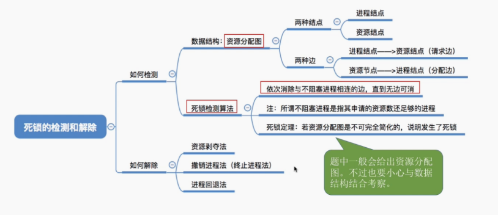

1. 预防死锁
  - 事先采取各种限制措施，破坏死锁产生条件中的一个或者几个，从而预防产生死锁。

  - **破坏请求和保持条件**。有两种方式。

  - 方式1：所有进程在运行之前，必须一次性地申请其在整个运行过程中所需的全部资源。这样进程在运行中，便不会再提出资源请求了，从而破坏了“请求”条件。系统在分配资源时，只要有一种资源不能满足进程的要求，即使其它所需的各项资源都空闲也不分配给该进程，而让该进程等待。由于该进程在等待期间未占有任何资源，于是破坏了“保持”条件。

    - 这种方式简单易行，但是资源被严重浪费了，因为进程一开始就一次性地占用了整个运行过程所需的全部资源，而其中有些资源可能仅在运行初期或运行快结束时才可能被使用。

    - 这种方式也会使得进程经常发生饥饿现象。如果个别资源长期被其它进程占用，而等待该资源的进程就迟迟不能开始运行，而个别资源可能仅在进程运行到最后才需要，比如打印机。那么就没有必要一开始就申请打印机这个资源。

  - 方式2：这种方式是对第一种方式的改进，它允许一个进程只获得运行初期所需的资源后就开始运行。程运行过程中再逐步释放已分配给自己的、且已用完的全部资源，然后再请求新的所需资源。这种方式提高了设备的利用率，还能减少进程发生饥饿的机率。

    **破坏“不可抢占”条件**

      当一个已经保持了某些不可被抢占资源的进程，提出新的资源请求而不能得到满足时，它必须释放已经保持的所有资源，待以后需要时再重新申请。这种方式可能会导致以前的工作失效。

    **破坏循环等待条件**

      把系统中所有资源顺序编号， 各进程按资源编号递增次序申请资源，通过这种方式不会出现环路。

2. 避免死锁

  - 避免死锁和预防死锁相比，所施加的限制条件较弱；但是要进行安全性检查。它是在资源的动态分配过程中，用某种方式防止系统进入不安全的状态。

  - 该方法中把系统的状态分为**安全状态**和**不安全状态**，只要使系统始终都处于安全状态，便可避免发生死锁。当系统处于不安全状态时，则可能进入死锁状态。所谓**安全状态**，是指系统能按某种进程顺序（P1,P2,…,Pn），来为每个进程Pi分配其所需资源，直至满足每个进程对资源的最大需求，使每个进程都可顺利地完成。如果系统无法找到这样一个安全推进的进程序列，则称系统处于不安全状态。

  - 避免死锁的基本思想就是确保系统始终处于安全状态，它允许进程动态地申请资源，当有进程请求一个可用资源时，应先计算此次资源分配的安全性。如果此次分配不会导致系统进入不安全的状态，才可以将资源分配给系统的进程。否则就让进程等待。

  - 最具代表性的避免死锁的办法是银行家算法。

3. 死锁的检测和解除
  - 检测死锁：保存有关资源的的请求和分配信息，再提供一种算法，它利用这些信息来检测系统是否已经进入死锁状态。利用**死锁定理**。我们可以画一个资源分配图，在资源分配图中进程结点和资源结点，有请求边和分配边。首先在图中找出既不阻塞又不孤立的进程结点，在顺利的情况下，这个节点可获得所需的资源直到运行完毕，然后释放占有的资源，消除掉该结点的请求边和分配边，使之成为孤立的结点。然后以此类推，对资源分配图进行一系列的简化，如果能消除图中所有的边，说明这个图是可以完全简化的，否则是不可完全简化的。变成死锁的充分条件是资源分配图是不可完全简化的。这就是死锁定理，用来检测是否发生了死锁。
    - 解除死锁有两种方式：
      - 资源剥夺法。挂起（暂时放到外存上）某些死锁进程，并抢占它的资源，将这些资源分配给其他的死锁进程，以解除死锁状态。
      - 终止或撤销进程。
        - 终止所有死锁进程：代价大，被终止进程的前期工作必须放弃
        - 按照某种顺序逐个终止进程，直至有足够的资源以打破循环等待，解除死锁为止。
        
