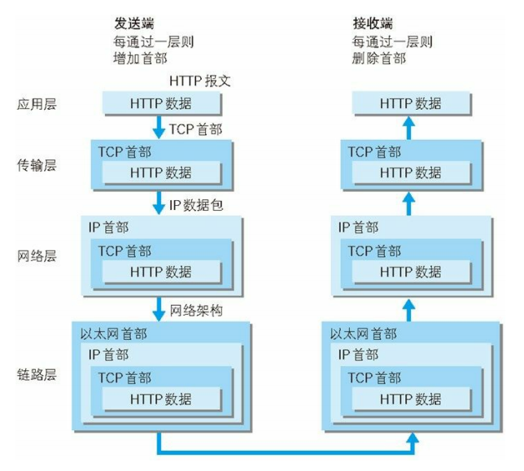
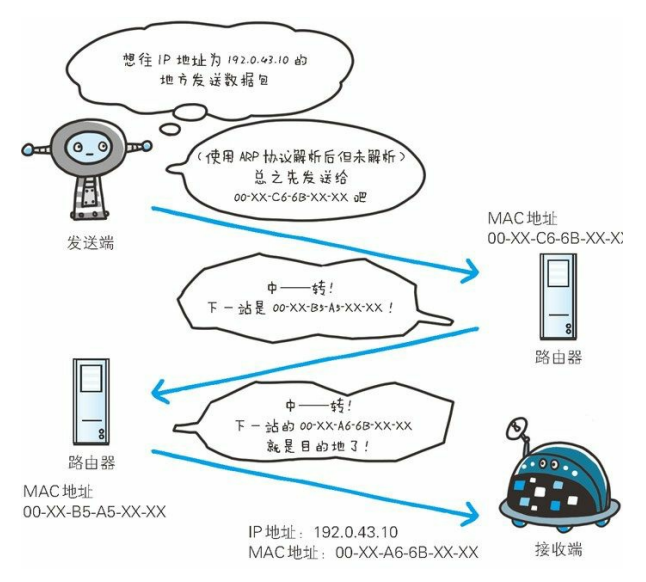
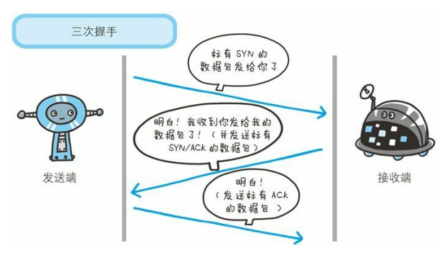
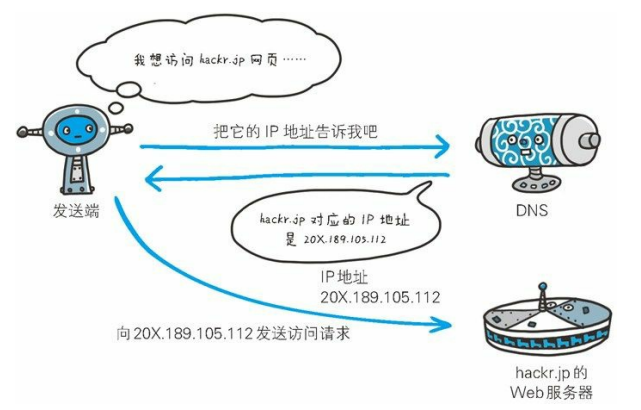
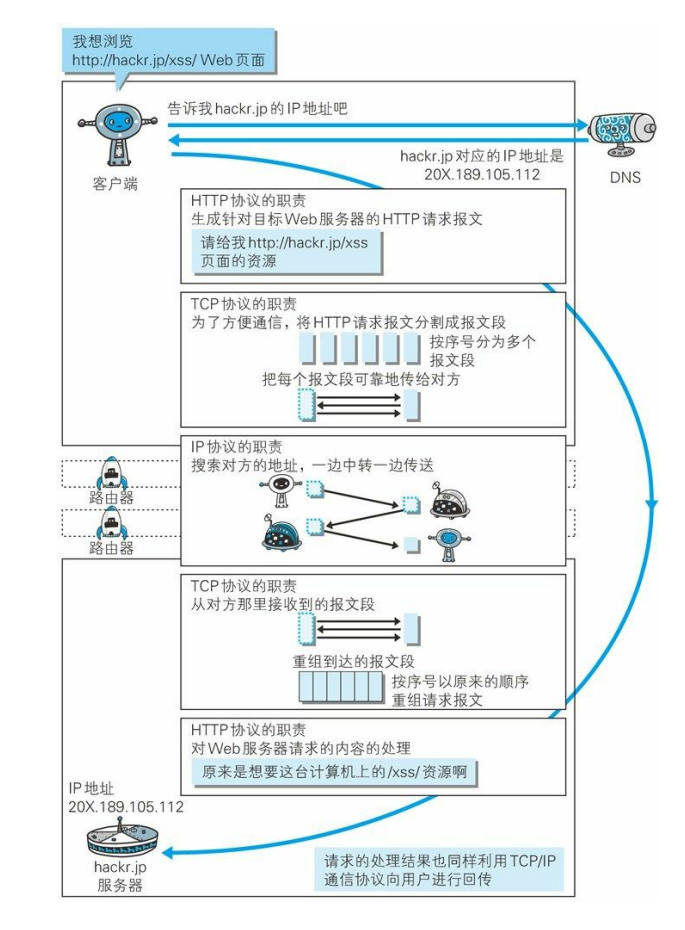

# 01 了解web及网络基础

## 1.1 使用HTTP协议访问Web
Web使用一种名为HTTP（HyperText Transfer Protocol，超文本传输协议）的协议作为规范，完成从客户端到服务端等一系列运作流程。而协议是只规则的约定。可以说，Web是建立在HTTP协议上通信的。
## 1.2 HTTP的诞生
### 1.2.1 为知识共享而规划Web
CERN（欧洲核子研究组织）的蒂姆·巴纳斯-李（Tim Berners-Lee）博士提出了一种能让远隔两地的研究者们共享知识的设想。   
最初设想的基本理念是：借助多文档之间相互关联形成的超文本，连成可互相参阅的WWW（World Wide Web，万维网）。   
现在已提出了3项WWW构建技术，分别是：
- 把SGML（Standard Generalized Markup Language）作为页面的文本标记语言HTML（HyperText Markup Language）；
- 作为文档传递协议的HTTP；
- 指定文档所在地址的URL（Uniform Resource Locator， 统一资源定位符）。
### 1.2.2 Web成长时代
- 日本第一个主页
- HTML1.0
- NCSA Mosaic bounce page
- The NCSA HTTPd Home Page（存档）
### 1.2.3 驻足不前的HTTP
HTTP有三个版本：
- HTTP/0.9
- HTTP/1.0
RFC1945 - HyperText Transfer Protocol -- HTTP/1.0
- HTTP/1.1
RFC2616 - HyperText Transfer Protocol -- HTTP/1.1   
作为Web文档传输协议的HTTP，它的版本几乎没有更新。新一代HTTP/2.0正在制订中，但要达到较高的覆盖率，仍需假以时日。
当年HTTP协议出现主要为了解决文本传输问题。由于协议本身非常简单，于是再此基础上设想了很多应用方法并投入了实际使用。现在HTTP协议已经长处了Web 这个框架的局限，被运用到了各种场景里。
## 1.3 网络基础TCP/IP
通常使用的网络（包括互联网）是在TCP/IP协议族的基础上运作的。而HTTP属于它内部的子集。
### 1.3.1 TCP/IP协议族
不同的硬件、操作系统之间的通信，所有的这一切都需要一种规则。而我们就把这种规则成为协议（protocol）。    
TCP/IP是互联网相关的各类协议族的总称：TCP、IP、HTTP、FTP、DNS、UDP、PPPoE、SNMP、IEEE 802.3、FDDI、ICMP
### 1.3.2 TCP/IP的分层管理
TCP/IP协议族按层次分别分为以下4层：应用层、传输层、网络层和数据链路层。   
把TCP/IP层次化是有好处的，比如，如果互联网只由一个协议统筹，某个地方需要改变设计时，就必须把所有部分整体换掉。而分层之后只需把变动的层替换掉即可。把各层之间的接口部分规划好之后，每个层次内部的设计就能够自由改动了。    
TCP/IP协议族各层的作用如下：
- 应用层    
应用层决定了向用户提供应用服务时通信的活动。    
TCP/IP协议族内预存了各类通用的应用服务。比如：FTP、DNS和HTTP
- 传输层
传输层对上层应用层，提供处于网络连接中的两台计算机之间的数据传输。    
在传输层有两个性质不同的协议：TCP和UDP。
- 网络层（又名为互连层）    
网络层用来处理在网络上流动的数据包。数据包是网络传输的最小数据单位。该层规定了通过怎样的路径（所谓的传输路线）到达对方计算机，并把数据包传送给对方。    
与对方计算机之间通过多台计算机或网络设备进行传输时，网络层所起的作用就是在众多的选项内选择一条传输路线。
- 链路层（又名数据链路层，网络接口层）    
用来处理连接网络的硬件部分。包括控制操作系统、硬件的设备驱动、NIC（Network Interface Card，网络适配器，即网卡），及光纤等物理可见部分（包括连接器等以切传输媒介）。硬件上的范畴均在链路层的作用范围之内。
### 1.3.3 TCP/IP通信传输流

利用 TCP/IP 协议族进行网络通信时，会通过分层顺序与对方进行通 信。发送端从应用层往下走，接收端则往应用层往上走。   
我们用 HTTP 举例来说明，首先作为发送端的客户端在应用层 （HTTP 协议）发出一个想看某个 Web 页面的 HTTP 请求。   
接着，为了传输方便，在传输层（TCP 协议）把从应用层处收到的数 据（HTTP 请求报文）进行分割，并在各个报文上打上标记序号及端 口号后转发给网络层。   
在网络层（IP 协议），增加作为通信目的地的 MAC 地址后转发给链 路层。这样一来，发往网络的通信请求就准备齐全了。   
接收端的服务器在链路层接收到数据，按序往上层发送，一直到应用 层。当传输到应用层，才能算真正接收到由客户端发送过来的 HTTP 请求。   
发送端在层与层之间传输数据时，每经过一层时必定会被打上一个该 层所属的首部信息。反之，接收端在层与层传输数据时，每经过一层 时会把对应的首部消去。    
这种把数据信息包装起来的做法称为封装（encapsulate）。
## 1.4 与HTTP关系密切的协议：IP、TCP和DNS
### 1.4.1 负责传输的IP协议

### 1.4.2 确保可靠性的TCP协议

## 1.5 负责域名解析的DNS服务
用户通常使用主机名或域名来访问对方的计算机，而不是直接通过 IP 地址访问。因为与 IP 地址的一组纯数字相比，用字母配合数字的表 示形式来指定计算机名更符合人类的记忆习惯。   
但要让计算机去理解名称，相对而言就变得困难了。因为计算机更擅 长处理一长串数字。   
为了解决上述的问题，DNS 服务应运而生。DNS 协议提供通过域名 查找 IP 地址，或逆向从 IP 地址反查域名的服务。

## 1.6 各种协议与HTTP协议的关系

## 1.7 URI和URL
